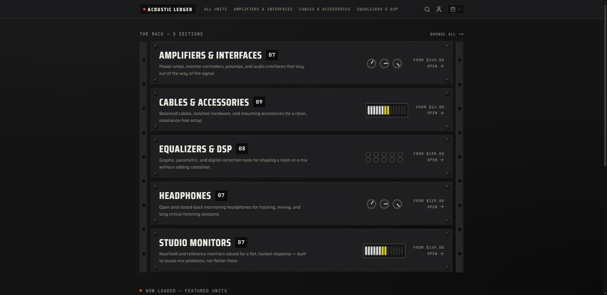
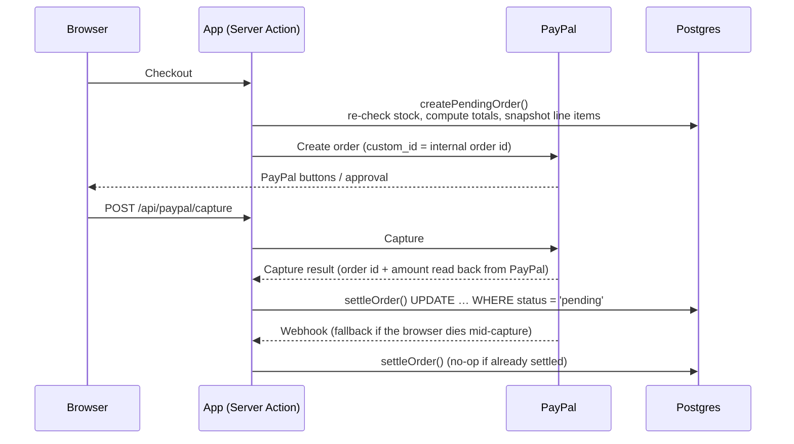

# Acoustic Ledger

**A production-shaped e-commerce storefront for reference-grade studio audio gear: catalog, cart, guest and account checkout, PayPal settlement, and an admin dashboard.**

**[Live demo →](https://acoustic-ledger-nine.vercel.app)**



> **This is a demo store.** The brand and its products are fictional. Payments run in the PayPal sandbox, so no real money is charged. The point of this project is the engineering, not the catalog.

---

## Why this project exists

Most storefront demos stop at "add to cart." Acoustic Ledger covers the parts that usually go wrong in production:

- **Charging the right amount.** Totals are always recomputed from the database and never trusted from the client.
- **Not overselling stock.** Stock is decremented exactly once, even when the capture call and the webhook arrive at the same time.
- **Keeping order history accurate.** Order line items are snapshotted, so later catalog edits never rewrite a past order.
- **Treating guests the same as account holders.** Guest checkout works fully, and a guest cart merges into the user's cart on sign-in.

## Features

### Storefront

- Home page with featured products
- Catalog with Postgres full-text search, category and price filters, sorting, and server-enforced pagination. All filter state lives in the URL, so links, reloads and the back button reproduce the same results.
- Product pages with an image gallery, a variant picker (size, finish, cable length) and stock-aware add-to-cart. Out-of-stock states are real.
- Cart for guests (httpOnly cookie) or signed-in users, with the guest cart merged into the user cart on sign-in
- PayPal checkout (Orders v2) with an order-status poller on the success page
- Order history for signed-in customers
- Mobile navigation, loading states, error boundaries and custom 404s

### Admin dashboard (`/admin`)

- Overview of store activity
- Product create/edit with an inline variant editor (stock, pricing, featured flags)
- Order list and order detail with lifecycle actions: `pending` → `paid` → `fulfilled`, or `cancelled` (restocks correctly)

### Auth

- Email/password sign-in, plus optional Google OAuth when configured
- JWT sessions with a `customer` or `admin` role on the token
- Race-safe registration against concurrent duplicate signups

## Tech stack

| Area | Tools |
|---|---|
| Framework | Next.js 16 (App Router, Turbopack), React 19, TypeScript |
| Data | PostgreSQL, Drizzle ORM (migrations with drizzle-kit) |
| Auth | Auth.js / NextAuth v5 (Credentials + optional Google), bcrypt |
| Payments | PayPal Orders v2 + webhooks (`@paypal/react-paypal-js`) |
| UI | Tailwind CSS v4, shadcn/ui ("base-nova" style on Base UI), lucide-react |
| Validation | Zod |
| Testing | Vitest |
| Infra | Vercel (hosting, Cron, Firewall), Neon Postgres in production, Docker Postgres locally |

## How checkout and settlement work

The checkout flow doesn't depend on a specific payment provider, and settlement is idempotent.



- **Amounts come from the server.** `createPendingOrder()` recomputes totals from the database inside a transaction. The capture route reads the order id and the amount paid back out of PayPal's response and compares them in integer cents.
- **Exactly one settlement wins.** The capture route and the webhook both call `settleOrder()`, which uses a conditional `UPDATE … WHERE status = 'pending'`. Only the caller that wins that row decrements stock, so a capture/webhook race can't double-decrement.
- **Restocks match what was taken.** The actual quantity decremented is recorded, so cancelling an order restocks exactly that amount.
- **Money is always integer cents.** Decimal strings appear only at the PayPal boundary.
- **Abandoned orders get cleaned up.** A daily Vercel Cron job sweeps `pending` orders older than about 24 hours.
- **There's a demo fallback.** `DEMO_CHECKOUT_FALLBACK=1` enables a "Simulate payment" path for live demos when the PayPal sandbox misbehaves. It uses the same settlement code, refuses to run unless the PayPal API base is exactly the sandbox host, and tags its orders with a `DEMO-` capture id.

## Security and hardening

- Defense-in-depth authorization: route gating in `proxy.ts`, plus `requireAdmin()` / `adminGuard()` on every protected page and action
- Security headers: HSTS, CSP (report-only by default, enforced with `CSP_ENFORCE=1`), `X-Frame-Options: DENY` and a permissions policy
- Application-level rate limiting on sign-in, registration, capture and demo checkout (`@vercel/firewall`)
- A token-gated `/api/health` diagnostic, a bounded Postgres connection pool, and a `Secure` guest cart cookie in production
- Catalog reads cached with tag-based invalidation, and foreign keys indexed
- `robots.txt` that allows search crawlers and blocks AI-training crawlers

See [SECURITY.md](SECURITY.md) for the full posture, the WAF configuration and the incident runbook.

## Repository layout

```
.
├── docker-compose.yml        # Local Postgres (port 5433)
├── DEPLOY.md                 # Production runbook (Vercel + Neon + PayPal)
├── PAYPAL_SETUP.md           # PayPal sandbox setup and gotchas
├── SECURITY.md               # Security posture and runbook
├── PRODUCT.md / DESIGN.md    # Product brief and design direction
└── store/                    # The Next.js application
    ├── src/
    │   ├── app/              # (shop) storefront, admin dashboard, api/ route handlers
    │   ├── actions/          # Server Actions (return ActionResult, never throw)
    │   ├── components/       # UI, including shadcn components in ui/
    │   ├── db/               # Drizzle schema, queries, seed
    │   ├── lib/              # cart, checkout, settlement, PayPal, rate limiting
    │   ├── auth.ts           # Node-only auth (adapter, providers)
    │   ├── auth.config.ts    # Edge-safe auth config
    │   └── proxy.ts          # Route gating (Next.js 16 middleware convention)
    ├── drizzle/              # Migrations
    ├── scripts/              # Diagnostic scripts
    └── tests/                # Vitest suite
```

## Getting started

**Prerequisites:** Node.js, Docker, and a PayPal developer account with sandbox credentials.

```bash
# 1. Start local Postgres (from the repo root)
docker compose up -d

# 2. Install dependencies (every npm command runs from store/)
cd store
npm install

# 3. Configure environment
cp .env.example .env.local
# then fill in the values (see below)

# 4. Create the schema and seed demo data
npm run db:migrate
npm run db:seed

# 5. Run it
npm run dev   # http://localhost:3000
```

Seeding creates 5 categories, 38 products and 66 variants, plus historical orders for the admin dashboard and two demo accounts:

| Role | Email | Password |
|---|---|---|
| Admin | `admin@demo.test` | `admin123` |
| Customer | `customer@demo.test` | `customer123` |

> These are demo credentials. They must never exist on a store handling real payments.

### Environment variables

`.env.example` documents every variable. The main ones:

| Variable | Purpose |
|---|---|
| `DATABASE_URL` | Postgres connection string (use Neon's pooled string in production) |
| `AUTH_SECRET` | Signs session JWTs. Generate with `npx auth secret` |
| `AUTH_GOOGLE_ID` / `AUTH_GOOGLE_SECRET` | Optional. Google sign-in is enabled only when both are set |
| `PAYPAL_CLIENT_ID` / `PAYPAL_CLIENT_SECRET` | PayPal sandbox credentials |
| `NEXT_PUBLIC_PAYPAL_CLIENT_ID` | Same as `PAYPAL_CLIENT_ID`. Inlined at build time |
| `PAYPAL_API_BASE` | `https://api-m.sandbox.paypal.com` |
| `PAYPAL_WEBHOOK_ID` | ID of the registered PayPal webhook |
| `DEMO_CHECKOUT_FALLBACK` | `1` to expose the sandbox-only "Simulate payment" button |
| `HEALTH_TOKEN` | Unlocks the detailed `/api/health` response |
| `CRON_SECRET` | Required for the daily pending-order sweep |
| `CSP_ENFORCE` | `1` to enforce the Content-Security-Policy instead of report-only |

Restart `npm run dev` after editing `.env.local`, because env changes aren't hot-reloaded.

## Scripts

Run from `store/`:

| Command | What it does |
|---|---|
| `npm run dev` | Start the dev server |
| `npm run build` / `npm start` | Production build / serve |
| `npm run lint` | ESLint |
| `npm test` | Run the Vitest suite once |
| `npm run test:watch` | Run Vitest in watch mode |
| `npm run db:generate` | Generate a migration from schema changes |
| `npm run db:migrate` | Apply migrations |
| `npm run db:seed` | Seed or reseed the catalog and demo data |

Diagnostic scripts (`npx tsx scripts/<name>.ts`):

- `check-db.ts` checks database reachability, TLS and latency
- `verify-settlement.ts` proves settlement can't double-decrement stock under duplicate or concurrent delivery
- `inspect-paypal-orders.ts`, `verify-paypal-order.ts` and `diagnose-paypal-account.ts` are PayPal sandbox probes

## Testing

The Vitest suite in `store/tests/` covers the parts where bugs cost money:

- Settlement idempotency and the capture/webhook race
- Transactional pending-order creation
- Cancel-and-restock accuracy
- Abandoned pending-order sweeps
- Guest cart cookie, cart merge on sign-in, and stable cart item order
- Catalog search pagination

## Deployment

The app deploys to **Vercel** with the Root Directory set to `store`, uses **Neon Postgres** in production, and runs entirely on free tiers. Builds never touch the database. [DEPLOY.md](DEPLOY.md) is the step-by-step runbook: Neon setup, environment variables, migrate and seed, PayPal webhook registration, and a smoke-test checklist.

## License

Copyright © 2026 Cold-Start. All rights reserved. This is proprietary source; see [LICENSE](LICENSE). Acoustic Ledger is a fictional brand created for this demo and isn't affiliated with any real company or product line.
